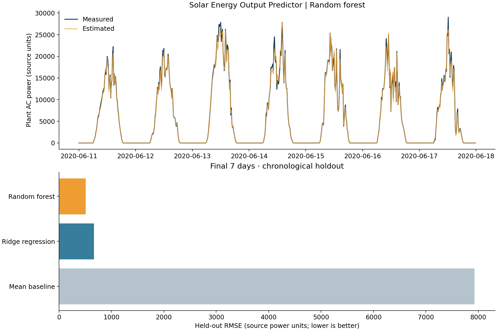

# Solar Energy Output Predictor

**Estimate solar-plant AC power from measured sunlight, ambient temperature, and time of day.**

An electrical-engineering × machine-learning portfolio project, built with Python and scikit-learn. It includes a reproducible data pipeline, chronological validation, a strong linear comparison, a random forest, automated tests, and a results report.



## The question

How accurately can we estimate the combined output of Plant 1's 22 inverters from same-time weather measurements?

This is **same-time power estimation**, not a day-ahead forecast. The inputs include measured irradiation at the target timestamp. A deployable future forecast would need forecast weather and evaluation at an explicit forecast horizon.

## Results

Models were selected using June 4–10, 2020 validation data, refitted on May 15–June 10, and evaluated on June 11–17. No random row splitting is used.

| Model | Test MAE | Test RMSE | Test R² |
|---|---:|---:|---:|
| Mean baseline | 7,139.8 | 7,926.6 | -0.0218 |
| Ridge regression | 414.3 | 669.3 | 0.9927 |
| **Random forest** | **236.0** | **508.4** | **0.9958** |

MAE and RMSE use source AC_POWER units. The source field is commonly described as kW, but this project does not independently calibrate the sensor scale. It intentionally avoids converting these readings to residential-system capacity or energy bills.

The forest reduced held-out RMSE by **24.0% relative to Ridge regression**. Its daylight-only RMSE was **712.6**, with R² **0.9903**, over 341 timestamps (IRRADIATION > 0.01 in source units). All-hours metrics benefit from easy nighttime readings. R² is not percentage prediction accuracy.

These are results from this specific short, single-site holdout, not a claim of general accuracy. All metrics and split dates: [metrics.json](reports/metrics.json).

## Run locally

Use Python 3.11 or 3.12. Run these commands from the project root:

```bash
python -m venv .venv
source .venv/bin/activate
pip install -r requirements.txt
python -m solar.download
python -m solar.train
python -m unittest discover -s tests -v
python -m solar.predict --irradiation 0.7 --temperature 30 --hour 12
```

On Windows, replace the activation command with `.venv\Scripts\activate`.

Open `reports/index.html` in your browser to view the report. Training regenerates the report, chart, metrics, comparison CSV, and local model artifact. Model files are deliberately not committed; train them yourself and only load trusted joblib files.

The download requires internet access. If Kaggle blocks the anonymous endpoint, download the source archive manually and put `Plant_1_Generation_Data.csv` and `Plant_1_Weather_Sensor_Data.csv` inside `data/raw/`. Do not replace them with fabricated data. See [data provenance](docs/DATA.md).

## Method

1. Parse the generation and weather timestamps using their explicit formats.
2. Reject duplicate sensor keys and mismatched plants. Remove invalid or negative power values.
3. Sum AC power only at timestamps with all 22 inverter readings. Retain 3,057 of 3,158 generation timestamps; do not fill missing inverter output with zero.
4. Join one weather measurement to each complete timestamp. Exclude invalid weather values.
5. Use irradiation, ambient temperature, and sine/cosine time-of-day features. Exclude DC power, yield counters, and target AC power from model inputs.
6. Split whole days chronologically: 20 training days, 7 validation days, 7 final test days. All scaling is fitted inside a pipeline using training data only.
7. Choose the lowest validation-RMSE candidate from three fixed model specifications. Refit each candidate on train + validation; compare on the untouched test period. Do not retune after seeing test results.
8. Apply the same nonnegative-output clipping policy to every model and report both all-hours and daylight-only metrics.

The inverter roster is inferred from the full file as a data-quality rule, not as a learned predictor. Deployment would require a fixed plant asset registry. No gap-filling or interpolation is performed. The timestamp timezone is unspecified by the files; time features use the source clock without timezone conversion.

## Project map

```text
solar/                  Download, validation, training, and prediction code
 tests/                 Data integrity and temporal-split tests
 reports/               Generated results and browser report
 docs/                  Data provenance and learning walkthrough
 .github/workflows/     Automated GitHub tests
```

## Limitations and next steps

- Only 34 days from one plant: no cross-season, cross-year, or cross-site validation.
- Complete-coverage filtering may favor healthier operating periods and excludes missing-data conditions.
- Weather measurements are assumed available at prediction time; real sensor latency is not tested.
- Prediction inputs must use the source sensor scales and site clock. Range checks cannot guarantee physically consistent combinations.
- No uncertainty intervals, fault-detection model, forecast-weather integration, or deployed service.
- Future work: rolling-origin evaluation across more months, capacity-normalized cross-site testing, a physics-based benchmark, and explicit day-ahead forecasts using archived forecast weather.

## Understand and present the project

Start with [the walkthrough](docs/WALKTHROUGH.md). Run it, inspect the code, and reproduce the results before putting the metrics on your CV. This project was built with AI assistance; describe your own contribution and understanding accurately.

Potential CV wording **after reproducing and understanding the project**:

> Developed a Python solar-power estimation pipeline using measured weather, compared baseline, Ridge, and random-forest models with chronological validation, and achieved 24% lower held-out RMSE than Ridge on a seven-day test period.

## Attribution

Data: [Solar Power Generation Data — Ani Kannal, Kaggle](https://www.kaggle.com/datasets/anikannal/solar-power-generation-data). Data remains subject to its source terms and is not included in this repository. Code is MIT-licensed; see LICENSE.
